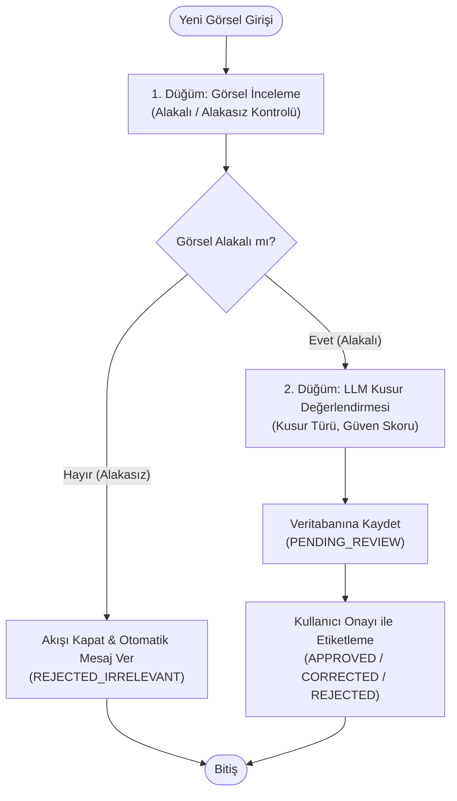

# VisionQC - LangGraph Destekli Kalite Kontrol ve Etiketleme Sistemi Backend (FastAPI)

Bu proje, **VisionQC** Kalite Kontrol ve **Kullanıcı Onayı ile Etiketleme (Human-in-the-Loop Annotation)** programı için **Katmanlı Mimari (Layered Architecture)** prensiplerine uygun olarak tasarlanmış, **LangGraph** tabanlı modern bir FastAPI backend uygulamasıdır.

---

## 🧠 LangGraph İş Akışı (Workflow Architecture)

Uygulamanın merkezinde `StateGraph` kullanan 2 düğümlü koşullu bir yapay zeka akışı yer alır:



### 1. Düğüm: Görsel İnceleme (Alakalı / Alakasız)
- Yüklenen görselin endüstriyel kalite kontrol, mekanik/elektronik parça veya üretim bandı öğesi olup olmadığını denetler.
- **Alakasız Görsel ise:** Akış 2. düğüme **geçmeden derhal sonlandırılır** ve veritabanına otomatik ret mesajıyla kaydedilir (`workflow_status: "REJECTED_IRRELEVANT"`, `review_status: "REJECTED"`).
- **Alakalı Görsel ise:** Akış bir sonraki LLM değerlendirme düğümüne yönlendirilir.

### 2. Düğüm: LLM Kusur Değerlendirmesi
- Parçada kusur olup olmadığını (`is_product_defect: bool`), parça/görsel kategorisini (`category: str`), kusur türünü ve detaylı açıklamasını (`defect_description`), güven skorunu (`confidence_score`) tespit eder.
- Çıktı olarak talep edilen JSON yapısını üretir:
```json
{
  "product_id": "PRD-LENS-101",
  "timestamp": "2026-10-02T19:00:56.543807+00:00",
  "category": "Optik Lens Grupları",
  "is_product_defect": true,
  "confidence_score": 0.942,
  "defect_description": "Yüzey Çizikleri: Optik eleman yüzeyinde 1.2mm uzunluğunda mikro çizik tespit edildi."
}
```

**Desteklenen kategoriler:** Optik Lens Grupları · Termal Kamera Modülleri · Gözetleme Üniteleri
**Başlıca kusur türleri:** Yüzey Çizikleri · Kaplama Kusurları · Optik Eksen Hizalama Hataları · Konektör Gevşekliği

LLM'in döndürdüğü kategori bu listeyle eşleştirilir; eşleşmezse varsayılan olarak `Optik Lens Grupları` atanır.

### 3. Kullanıcı Onayı ile Etiketleme (Human-in-the-Loop)
- AI çıktısı oluştuktan sonra görev `PENDING_REVIEW` durumunda operatörün önüne düşer.
- Operatör:
  - **APPROVED:** AI tahminini onaylayabilir,
  - **CORRECTED:** AI'ın yanlış bildiği durumlarda etiketi ve kusur tanımını düzeltebilir,
  - **REJECTED:** İncelemeyi reddedebilir.

---

## 🤖 Çoklu LLM Sağlayıcı Desteği (Google Gemini & OpenAI)

Sistem `LLMNodeBuilder` üzerinden hem **Google Gemini** hem de **OpenAI** modellerini destekleyecek şekilde tasarlanmıştır:
- **Varsayılan Sağlayıcı:** Google Gemini (kod varsayılanı `gemini-2.5-flash`, `GEMINI_MODEL` ile değiştirilebilir)
- `.env` üzerinden `LLM_PROVIDER="gemini"` ve `GEMINI_API_KEY` belirlenerek doğrudan kullanılabilir.
- İstenirse `LLM_PROVIDER="openai"` ve `OPENAI_API_KEY` ile OpenAI Vision modellerine (`gpt-4o-mini`) tek bir parametreyle geçilebilir.
- Tercih edilen sağlayıcının anahtarı yoksa diğer sağlayıcının anahtarı denenir.
- API anahtarı girilmediğinde, istemci başlatılamadığında veya kota aşıldığında (HTTP 429) geliştirme ve testleri engellememek için anahtar kelime tabanlı heuristik fallback motoru çalışır.

---

## 🏛️ Katmanlı Mimari (Directory Structure)

```
use-case-backend/
├── app/
│   ├── api/v1/endpoints/
│   │   ├── inspections.py       # LangGraph analiz & İnsan etiketleme API uçları
│   │   ├── analytics.py         # Etiketleme ilerlemesi ve kusur oranları dashboard'u
│   │   ├── health.py            # Sağlık kontrolü
│   │   └── seed.py              # Demo etiketleme verileri yükleme
│   ├── api/v1/router.py         # Tüm endpoint router'larını /api/v1 altında toplar
│   ├── workflows/
│   │   ├── state.py                 # QCState (paylaşılan LangGraph durumu)
│   │   ├── pipeline.py              # Derlenmiş graf (qc_graph) & run_qc_pipeline()
│   │   ├── builders/
│   │   │   ├── graph_builder.py     # StateGraph kurulumu, koşullu geçişler
│   │   │   └── llm_node_builder.py  # Gemini / OpenAI / Fallback LLM istemcisi
│   │   ├── nodes/
│   │   │   ├── relevance_node.py    # 1. Düğüm + should_continue yönlendiricisi
│   │   │   └── defect_node.py       # 2. Düğüm: Kusur değerlendirmesi
│   │   └── quality_control_graph.py # Geriye dönük uyumluluk için yeniden dışa aktarım
│   ├── services/
│   │   ├── inspection_service.py    # LangGraph orkestrasyonu & İnsan onayı iş mantığı
│   │   └── analytics_service.py     # Etiketleme metrik hesaplamaları
│   ├── repositories/
│   │   ├── base.py                  # Generic Asenkron BaseRepository
│   │   └── inspection_task_repository.py # Dinamik filtreli sorgular ve sayaçlar
│   ├── models/
│   │   ├── base.py                  # TimestampMixin
│   │   └── inspection_task.py       # Veritabanı Etiketleme ve Analiz Tablosu
│   ├── schemas/
│   │   ├── inspection_task.py       # Pydantic v2 DTO'ları & LLMEvaluationOutput
│   │   └── analytics.py             # Dashboard metrik şeması
│   ├── core/
│   │   ├── config.py                # Pydantic Settings (.env)
│   │   ├── database.py              # Async SQLite & SQLAlchemy 2.0
│   │   └── exceptions.py            # Global hata yönetimi
│   ├── seed/
│   │   └── seeder.py                # Gerçekçi örnek etiketleme görevleri
│   ├── utils/                       # image, json, date yardımcıları & model→DTO mapper'ları
│   └── main.py                     # FastAPI Factory, Lifespan, CORS
├── tests/
│   ├── test_api.py                 # API entegrasyon testleri
│   └── test_utils.py               # Yardımcı fonksiyon birim testleri
├── docs/
│   └── TEKNIK_DOKUMAN.md           # Diyagramlı teknik doküman
├── run.py                          # CLI Çalıştırma betiği
├── requirements.txt
├── Dockerfile, docker-compose*.yml
└── .env.example
```

---

## 📡 API Uç Noktaları

| Metot | Endpoint | Açıklama |
|---|---|---|
| `POST` | `/api/v1/inspections/analyze` | **LangGraph analizini başlatır.** Alakasız ise akışı kapatır, alakalı ise kusur JSON'ı üretir ve etiketleme görevi açar. |
| `GET` | `/api/v1/inspections/tasks` | Görevleri sayfalı listeler (filtreler: `review_status`, `is_relevant`, `is_product_defect`, `product_id`, `category`; sayfalama: `page`, `limit` ≤ 100). |
| `GET` | `/api/v1/inspections/tasks/{id}` | Tekil görevin detayını ve AI çıktısını döner. |
| `POST` | `/api/v1/inspections/tasks/{id}/review` | **Kullanıcı Onayı ile Etiketleme.** Operatör onaylar (`APPROVED`), düzeltir (`CORRECTED`) veya reddeder (`REJECTED`). |
| `DELETE` | `/api/v1/inspections/tasks/{id}` | Görevi siler. |
| `GET` | `/api/v1/inspections/categories` | Desteklenen ürün kategorileri ve başlıca kusur türleri. |
| `GET` | `/api/v1/analytics/dashboard` | Toplam etiketlenen, bekleyen, AI vs İnsan kusur doğruluk metrikleri ve son 6 görev. |
| `GET` | `/api/v1/health` | Sağlık kontrolü: DB bağlantısı, motor tipi (SQLite/PostgreSQL/NeonDB) ve LLM durumu. |
| `POST` | `/api/v1/seed?force=false` | Demo etiketleme verilerini yükler (`force=true` mevcut verileri sıfırlar). |

**Örnek istek** (`image_base64` veya `image_url` alanlarından en az biri zorunludur):
```json
POST /api/v1/inspections/analyze
{ "product_id": "PRD-LENS-101", "image_base64": "data:image/png;base64,..." }
```

**Hata formatı:** `{ "success": false, "error": { "type": "EntityNotFoundError", "message": "...", "status_code": 404 } }`

> Diyagramlı detaylı anlatım için: [docs/TEKNIK_DOKUMAN.md](docs/TEKNIK_DOKUMAN.md)

---

## 🚀 Çalıştırma ve Test

```bash
# Ortam değişkenlerini hazırlayın (API anahtarı olmadan fallback modunda çalışır):
cp .env.example .env

# Sanal ortamı oluşturun / etkinleştirin ve bağımlılıkları kurun:
python3 -m venv venv && source venv/bin/activate
pip install -r requirements.txt

# Sunucuyu başlatın:
python run.py

# Testleri çalıştırın (13/13 Passed):
PYTHONPATH=. pytest -v tests
```

- **Swagger UI**: [http://localhost:8000/docs](http://localhost:8000/docs)
- **ReDoc UI**: [http://localhost:8000/redoc](http://localhost:8000/redoc)

---

## 🐘 NeonDB (Serverless PostgreSQL) Entegrasyonu

Proje, **NeonDB** serverless PostgreSQL bağlantısını destekleyecek şekilde `asyncpg` ve connection pooling ile optimize edilmiştir:

1. [Neon.tech](https://neon.tech) konsolundan veritabanı bağlantı dizesini kopyalayın.
2. `.env` dosyasındaki `DATABASE_URL` değişkenine yapıştırın:
```env
DATABASE_URL="postgresql+asyncpg://neondb_owner:<password>@ep-xxxx.neon.tech/neondb?sslmode=require"
```
*(Not: `postgresql://` olarak yapıştırsanız dahi sistem otomatik olarak `postgresql+asyncpg://` sürücüsüne dönüştürür.)*

3. Sunucuyu başlattığınızda (`python run.py`), tablolar otomatik olarak NeonDB üzerinde oluşturulacak ve seed verileri yüklenecektir.

---

## 🐳 Docker & Docker Compose Entegrasyonu

Proje, hem tek başına Docker konteyneri olarak hem de dahili PostgreSQL servisi içeren çoklu konteyner mimarisinde (**Docker Compose**) çalışmaya hazır şekilde yapılandırılmıştır.

### 📦 Docker Mimarisi ve Dosyalar

- **[`Dockerfile`](Dockerfile)**: Güvenli, hafif `python:3.12-slim` tabanlı, ayrıcalıksız (`appuser`, non-root) kullanıcı ile çalışan, otomatik healthcheck içeren optimize edilmiş imaj.
- **[`docker-compose.yml`](docker-compose.yml)**: Backend API ve kalıcı hacme sahip (`postgres_data`) PostgreSQL 16 Alpine servislerini birbirine bağlayan ana compose yapılandırması.
- **[`docker-compose.dev.yml`](docker-compose.dev.yml)**: Geliştirme ortamında kod değişikliklerinin anında konteynere yansımasını sağlayan Canlı Kod Yenileme (Hot-Reload) yapılandırması.
- **[`.dockerignore`](.dockerignore)**: `.env`, sanal ortamlar, test kalıntıları ve yerel SQLite dosyalarının imaja dahil edilmesini engelleyerek hızlı ve güvenli derleme sağlar.

### 🚀 Docker Compose ile Çalıştırma

#### 1. Tam Yığın (Backend + PostgreSQL) Başlatma
Varsayılan olarak Docker Compose hem PostgreSQL konteynerini hem de FastAPI backend'ini başlatır:

```bash
# Arka planda derle ve başlat:
docker compose up --build -d

# Logları canlı takip et:
docker compose logs -f backend

# Servis durumlarını ve sağlık kontrollerini listele:
docker compose ps
```

API hazır olduğunda şu adreslerden erişilebilir:
- **API Hoşgeldiniz:** [http://localhost:8000/](http://localhost:8000/)
- **Hızlı Health Check:** [http://localhost:8000/health](http://localhost:8000/health)
- **Detaylı Sistem Durumu:** [http://localhost:8000/api/v1/health](http://localhost:8000/api/v1/health)
- **Swagger UI:** [http://localhost:8000/docs](http://localhost:8000/docs)

#### 2. Canlı Geliştirme Modu (Hot-Reload ile)
Yerel dosyalarınızdaki değişikliklerin konteyneri yeniden derlemeden anında devreye girmesi için:

```bash
docker compose -f docker-compose.yml -f docker-compose.dev.yml up
```

#### 3. Yalnızca Backend Başlatma (Mevcut NeonDB veya SQLite ile)
PostgreSQL konteynerini başlatmadan, doğrudan `.env` dosyanızdaki NeonDB veya SQLite bağlantısını kullanmak isterseniz:

```bash
docker compose up backend --build
```

#### 4. Servisleri Kapatma ve Temizleme
```bash
# Servisleri durdur:
docker compose down

# Veritabanı verilerini de tamamen sıfırlamak isterseniz (volume temizliği):
docker compose down -v
```

