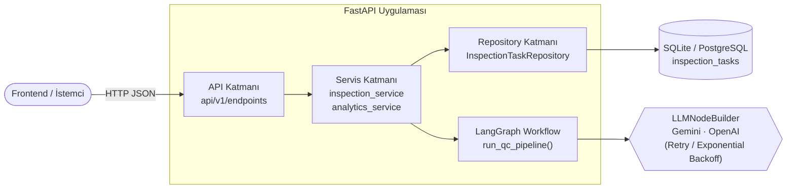
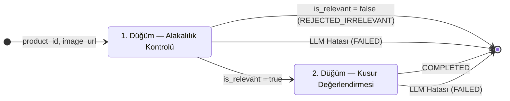
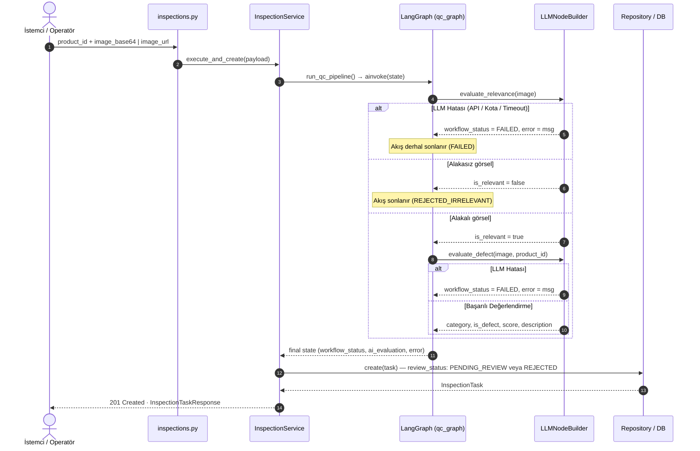

# VisionQC Backend — Teknik Doküman

**Kapsam:** LangGraph tabanlı görsel kalite kontrol akışı, insan onaylı etiketleme (Human-in-the-Loop), hata toleransı ve REST API.
**Teknolojiler:** FastAPI · LangGraph `StateGraph` · LangChain (Gemini / OpenAI) · SQLAlchemy 2.0 (async) · SQLite / PostgreSQL (NeonDB) · Docker

---

## 1. Mimari Genel Bakış

Uygulama katmanlı mimariyle kurulmuştur. Her katman yalnızca bir alt katmanla konuşur; LangGraph iş akışı servis katmanından çağrılan bağımsız bir modüldür.



| Katman | Sorumluluk |
|---|---|
| `api/` | Rotalar, girdi doğrulama (Pydantic v2), HTTP durum kodları, filtreler ve yeniden deneme (retry) |
| `services/` | İş mantığı: akışı tetikleme, inceleme kaydı, hata yönetimi, metrik hesaplama |
| `workflows/` | LangGraph grafiği, düğümler (`nodes/`), oluşturucular (`builders/`) ve durum yönetimi (`state.py`) |
| `repositories/` | Asenkron CRUD, filtreli sorgular, durum sayaçları |
| `core/` | Ayarlar (`.env`), veritabanı oturumu, şema migrasyonu, global hata yönetimi |

---

## 2. LangGraph İş Akışı

Graf [graph_builder.py](../app/workflows/builders/graph_builder.py) içinde derlenir: iki düğüm ve koşullu kenarlardan oluşur. Tüm düğümler ortak `QCState` sözlüğünü okur ve günceller.



- **`check_relevance`** — Görselin elektro-optik hedef kategorilerle (Optik Lens Grupları, Termal Kamera Modülleri, Gözetleme Üniteleri) ilgili olup olmadığını denetler. Alakasızsa akış `REJECTED_IRRELEVANT` ile sonlanır. LLM çağrısı başarısız olursa akış `FAILED` durumuna geçer.
- **`should_continue`** — Koşullu yönlendirici:
  - `workflow_status == "FAILED"` ise akış anında `END`'e yönlendirilir.
  - `is_relevant is True` ise `evaluate_defect` düğümüne dallanır.
  - Aksi takdirde `END`'e dallanır.
- **`evaluate_defect`** — Parçanın kategorisini, `is_product_defect`, `confidence_score` ve `defect_description` alanlarını üretir.
  - Kategori hedef listede yoksa sessizce varsayılan atanmaz; modelin bulduğu kategori veya tanımsız olarak korunur.
  - Model güven skoru döndürmezse yapay bir varsayılan (0.95 gibi) **atanmaz** (`None` olarak bırakılır).

### `QCState` Durum Alanları

| Alan | Tip | Açıklama |
|---|---|---|
| `product_id` | `str` | Ürün kodu / seri numarası |
| `image_url` | `str` | Analiz edilen görsel URL veya Base64 verisi |
| `timestamp` | `str` | ISO 8601 analiz zaman damgası |
| `is_relevant` | `Optional[bool]` | Parçanın incelenebilir elektro-optik kapsamda olup olmadığı |
| `relevance_message` | `Optional[str]` | Alakalılık / alakasızlık gerekçesi |
| `is_product_defect` | `Optional[bool]` | Kusur tespit edilip edilmediği |
| `confidence_score` | `Optional[float]` | Modelin kendi güven derecesi (kalibre edilmemiş) |
| `defect_description` | `Optional[str]` | Kusur açıklaması veya standart uygunluk bilgisi |
| `category` | `Optional[str]` | Tespit edilen ürün grubu |
| `workflow_status` | `str` | `PENDING`, `PROCESSING`, `COMPLETED`, `REJECTED_IRRELEVANT`, `FAILED` |
| `error` | `Optional[str]` | Hata durumunda fırlatılan teknik mesaj veya kota uyarısı |
| `evaluation_source` | `Optional[str]` | Değerlendirmenin kaynağı (`llm` veya `fallback`) |
| `model_version` | `Optional[str]` | Kullanılan model adı (örn: `gemini-2.5-flash`, `gpt-4o-mini`) |
| `prompt_version` | `Optional[str]` | Kullanılan prompt sürümü (örn: `v2.1`) |

---

## 3. Üretim Güvenliği, LLM Hata Yönetimi ve Yeniden Deneme (Retry)

### 3.1 Neden Heuristik Fallback Kaldırıldı?
Önceki mimaride, API anahtarı geçersiz olduğunda veya kota (429) aşıldığında sistem dosya adı veya URL içindeki anahtar kelimelere bakarak (`_fallback_defect`) karar üretiyordu. Örneğin:
- Base64 ile gelen her görsel otomatik olarak "alakalı" sayılıyordu.
- Görsel URL'sinde `"scratch"` yoksa parça otomatik olarak **"kusursuz, güven skoru: 0.985"** kabul ediliyordu.

**Endüstriyel Kalite Kontrolde Risk:** Bu durum, ağ kesintisi veya API hatasında **kusurlu bir parçanın hattan sağlam gibi geçmesine (False Negative)** neden olmaktadır. Kalite güvence ilkeleri gereğince, model çalışmadığında sahte sonuç uydurulamaz; sistem güvenli duruma geçmeli ve görevi `FAILED` olarak işaretlemelidir.

### 3.2 Hata Yönetimi ve Üstel Geri Çekilme (Exponential Backoff)
1. **Yeniden Deneme:** `LLMNodeBuilder._invoke_with_retry()` metodu geçici ağ aksamaları ve 429 kota durumlarında `LLM_MAX_RETRIES` (varsayılan: 2) defa üstel geri çekilme (`0.5s`, `1.0s`) ile yeniden çağrı yapar.
2. **FAILED Durumuna Geçiş:** Tüm denemeler başarısız olursa akış `workflow_status = "FAILED"` durumuna geçer, hata ayrıntısı `error` alanına yazılır ve uydurma kusur/kategori verisi girilmez.
3. **Yeniden Deneme Uç Noktası (`POST /tasks/{id}/retry`):** Ağ veya kota sorunu giderildiğinde, operatör veya kuyruk yöneticisi başarısız görevi sıfırdan oluşturmaya gerek kalmadan tek bir API çağrısıyla yeniden çalıştırabilir.
4. **Denetim İzi (Auditability):** Her kayda `evaluation_source` (`llm` / `fallback`), `model_version` ve `prompt_version` alanları yazılarak hangi tahminin hangi model ve talimatla üretildiği kayıt altına alınır.

---

## 4. Güven Skoru Kalibrasyonu Problemi

LLM'lerin ürettiği `"confidence_score": 0.94` gibi değerler **istatistiksel bir posterior olasılık $P(\text{defect} \mid \text{image})$ değildir.**
- LLM, metin üretiminde token olasılıklarını optimize eder; kendi kendine verdiği sayısal güven değeri (verbalized confidence) aşırı güvenli olma (overconfidence) eğilimindedir.
- Eski kodda değer dönmediğinde varsayılan olarak `0.95` atanıyordu. Bu durum düzeltilmiş; model değer döndürmezse `confidence_score = null` olarak bırakılmaktadır.
- Kategori eşleşmediğinde sessizce `"Optik Lens Grupları"`na zorlanması engellenmiş, modelin gerçek tahmini şeffaf şekilde korunmuştur.

---

## 5. Uçtan Uca Analiz Akışı (`POST /inspections/analyze`)



---

## 6. API Uç Noktaları

Tüm rotalar `/api/v1` önekiyle sunulur. Swagger arayüzü: `/docs` · ReDoc: `/redoc`.

| Metot | Endpoint | Açıklama |
|---|---|---|
| `POST` | `/inspections/analyze` | LangGraph akışını çalıştırır, görev oluşturur (`201`) |
| `POST` | `/inspections/tasks/{id}/retry` | Başarısız (`FAILED`) veya mevcut görevi yeniden LangGraph akışına sokar |
| `GET` | `/inspections/tasks` | Sayfalı liste · filtreler: `review_status`, `workflow_status`, `is_relevant`, `is_product_defect`, `product_id`, `category`, `page`, `limit` |
| `GET` | `/inspections/tasks/{id}` | Görev detayı, AI değerlendirmesi ve hata detayları |
| `POST` | `/inspections/tasks/{id}/review` | İnsan onayı: `APPROVED` / `CORRECTED` / `REJECTED` |
| `DELETE` | `/inspections/tasks/{id}` | Görevi siler |
| `GET` | `/inspections/categories` | Desteklenen kategoriler ve başlıca kusur türleri |
| `GET` | `/analytics/dashboard` | Toplam, bekleyen, onaylanan, düzeltilen ve başarısız (`failed_count`) metrikleri |
| `GET` | `/health` | DB bağlantısı, motor tipi (SQLite/PostgreSQL/NeonDB), LLM durumu |
| `POST` | `/seed?force=` | Demo verisi yükler |

**Standart Yanıt Yapısı (`InspectionTaskResponse`):**

```json
{
  "id": 1,
  "product_id": "PRD-LENS-101",
  "image_url": "https://industrial-samples.com/parts/lens.jpg",
  "category": "Optik Lens Grupları",
  "is_relevant": true,
  "relevance_message": "Görsel elektro-optik kalite kontrol incelemesi için uygundur.",
  "workflow_status": "COMPLETED",
  "error": null,
  "evaluation_source": "llm",
  "model_version": "gemini-2.5-flash",
  "prompt_version": "v2.1",
  "ai_evaluation": {
    "product_id": "PRD-LENS-101",
    "timestamp": "2026-10-02T19:00:56.543807+00:00",
    "category": "Optik Lens Grupları",
    "is_product_defect": true,
    "confidence_score": 0.942,
    "defect_description": "Yüzey Çizikleri: Optik eleman yüzeyinde mikro çizik tespit edildi.",
    "evaluation_source": "llm",
    "model_version": "gemini-2.5-flash",
    "prompt_version": "v2.1"
  },
  "review_status": "PENDING_REVIEW",
  "user_is_defect": null,
  "user_defect_description": null,
  "user_category": null,
  "user_notes": null,
  "reviewed_by": null,
  "reviewed_at": null,
  "created_at": "2026-10-02T19:00:56.543807+00:00",
  "updated_at": "2026-10-02T19:00:56.543807+00:00"
}
```

---

## 7. Çalıştırma ve Test

| Ortam | Komut |
|---|---|
| Yerel | `source venv/bin/activate && python run.py` |
| Docker (API + PostgreSQL 16) | `docker compose up --build -d` |
| Hot-reload | `docker compose -f docker-compose.yml -f docker-compose.dev.yml up` |
| Testler | `source venv/bin/activate && pytest` |

Uygulama açılışta (`lifespan`) tabloları oluşturur, şema migrasyonunu tamamlar ve veritabanı boşsa seed verisini yükler.
