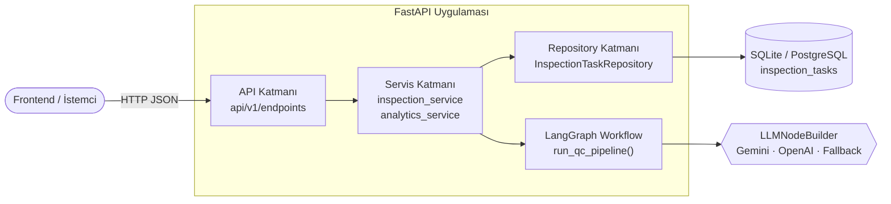
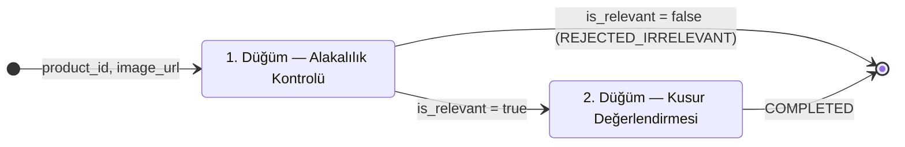
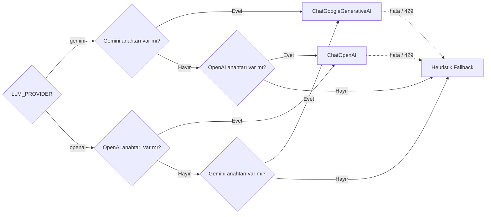
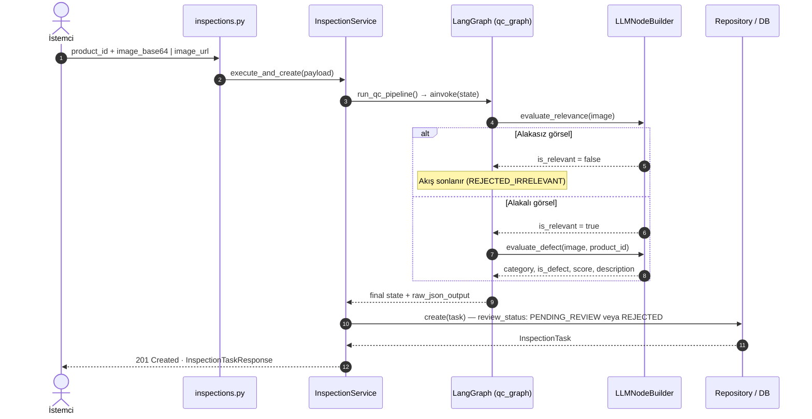
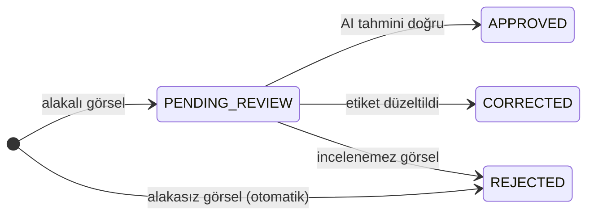

# VisionQC Backend — Teknik Doküman

**Kapsam:** LangGraph tabanlı görsel kalite kontrol akışı, insan onaylı etiketleme (Human-in-the-Loop) ve REST API.
**Teknolojiler:** FastAPI · LangGraph `StateGraph` · LangChain (Gemini / OpenAI) · SQLAlchemy 2.0 (async) · SQLite / PostgreSQL (NeonDB) · Docker

---

## 1. Mimari Genel Bakış

Uygulama katmanlı mimariyle kurulmuştur. Her katman yalnızca bir alt katmanla konuşur; LangGraph iş akışı servis katmanından çağrılan bağımsız bir modüldür.



| Katman | Sorumluluk |
|---|---|
| `api/` | Rotalar, girdi doğrulama (Pydantic v2), HTTP durum kodları |
| `services/` | İş mantığı: akışı tetikleme, inceleme kaydı, metrik hesaplama |
| `workflows/` | LangGraph grafiği, düğümler (`nodes/`) ve oluşturucular (`builders/`) |
| `repositories/` | Asenkron CRUD, filtreli sorgular ve sayaçlar |
| `core/` | Ayarlar (`.env`), veritabanı oturumu, global hata yönetimi |

---

## 2. LangGraph İş Akışı

Graf [graph_builder.py](../app/workflows/builders/graph_builder.py) içinde derlenir: iki düğüm ve bir koşullu kenardan oluşur. Tüm düğümler ortak `QCState` sözlüğünü okur ve günceller.



- **`check_relevance`** — Görselin hedef kategorilerle (Optik Lens Grupları, Termal Kamera Modülleri, Gözetleme Üniteleri) ilgili olup olmadığını denetler. Alakasızsa kusur alanları `null` bırakılır ve akış hemen sonlanır.
- **`should_continue`** — Koşullu yönlendirici; `is_relevant is True` ise `evaluate_defect`, değilse `END` döner.
- **`evaluate_defect`** — Kategoriyi, `is_product_defect`, `confidence_score` (0–1) ve `defect_description` alanlarını üretir. LLM'in döndürdüğü kategori sabit listeyle eşleştirilir; eşleşmezse varsayılan kategori atanır.

**`QCState` alanları:** `product_id`, `image_url`, `timestamp`, `is_relevant`, `relevance_message`, `category`, `is_product_defect`, `confidence_score`, `defect_description`, `workflow_status` (`PENDING → PROCESSING → COMPLETED | REJECTED_IRRELEVANT`).

### LLM Sağlayıcı Seçimi ve Fallback

`LLMNodeBuilder`, `.env` içindeki `LLM_PROVIDER` tercihine göre istemciyi seçer. Anahtar yoksa, istemci başlatılamazsa ya da kota (429) aşılırsa akış kesilmez; anahtar kelimeye dayalı heuristik değerlendirme devreye girer.



---

## 3. Uçtan Uca Analiz Akışı (`POST /inspections/analyze`)



---

## 4. Görev Yaşam Döngüsü (Human-in-the-Loop)

Alakalı görseller `PENDING_REVIEW` durumunda operatöre düşer. Operatörün `POST /tasks/{id}/review` çağrısı AI tahmininin yanına insan etiketini (`user_is_defect`, `user_category`, `user_defect_description`, `reviewed_by`, `reviewed_at`) yazar; AI çıktısı değiştirilmez, böylece AI ile insan kararı karşılaştırılabilir.



---

## 5. API Uç Noktaları

Tüm rotalar `/api/v1` önekiyle sunulur. Swagger: `/docs` · ReDoc: `/redoc`.

| Metot | Endpoint | Açıklama |
|---|---|---|
| `POST` | `/inspections/analyze` | LangGraph akışını çalıştırır, görev oluşturur (`201`) |
| `GET` | `/inspections/tasks` | Sayfalı liste · filtreler: `review_status`, `is_relevant`, `is_product_defect`, `product_id`, `category`, `page`, `limit` (≤100) |
| `GET` | `/inspections/tasks/{id}` | Görev detayı ve AI çıktısı |
| `POST` | `/inspections/tasks/{id}/review` | İnsan onayı: `APPROVED` / `CORRECTED` / `REJECTED` |
| `DELETE` | `/inspections/tasks/{id}` | Görevi siler |
| `GET` | `/inspections/categories` | Desteklenen kategoriler ve başlıca kusur türleri |
| `GET` | `/analytics/dashboard` | Toplam, bekleyen, onaylanan, düzeltilen görevler; AI kusur oranı; son 6 görev |
| `GET` | `/health` | DB bağlantısı, motor tipi (SQLite/PostgreSQL/NeonDB), LLM durumu |
| `POST` | `/seed?force=` | Demo verisi yükler |

**Örnek istek ve AI çıktısı (`ai_evaluation`):**

```json
// POST /api/v1/inspections/analyze
{ "product_id": "PRD-LENS-101", "image_base64": "data:image/png;base64,..." }

// Yanıttaki ai_evaluation alanı
{
  "product_id": "PRD-LENS-101",
  "timestamp": "2026-10-02T19:00:56.543807+00:00",
  "category": "Optik Lens Grupları",
  "is_product_defect": true,
  "confidence_score": 0.942,
  "defect_description": "Yüzey Çizikleri: Optik eleman yüzeyinde 1.2mm mikro çizik tespit edildi."
}
```

**Hata formatı:** `AppException` türevleri (`EntityNotFoundError` → 404, `BusinessLogicError` → 422) tek bir JSON yapısında döner: `{ "success": false, "error": { "type", "message", "status_code" } }`. İstek gövdesinde `image_base64` ve `image_url` alanlarının ikisi de yoksa Pydantic doğrulaması 422 döner.

---

## 6. Çalıştırma

| Ortam | Komut |
|---|---|
| Yerel | `source venv/bin/activate && python run.py` |
| Docker (API + PostgreSQL 16) | `docker compose up --build -d` |
| Hot-reload | `docker compose -f docker-compose.yml -f docker-compose.dev.yml up` |
| Testler | `PYTHONPATH=. pytest -v tests/test_api.py` |

Uygulama açılışta (`lifespan`) tabloları oluşturur ve veritabanı boşsa seed verisini yükler.
